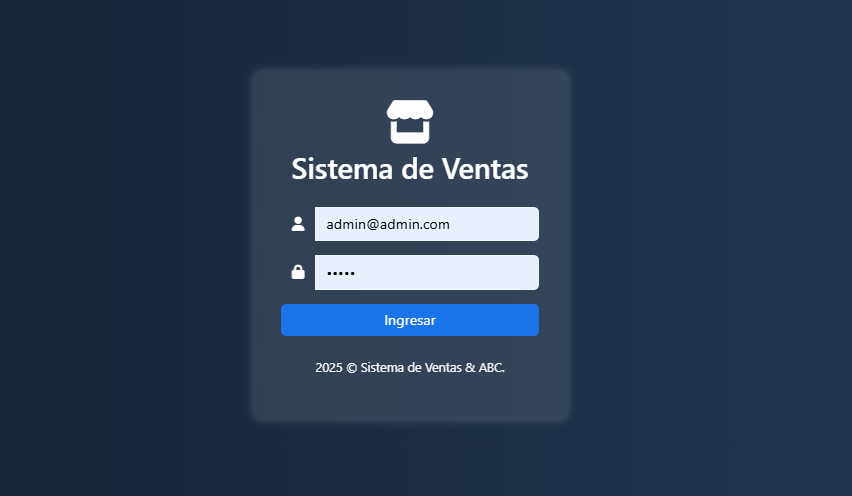
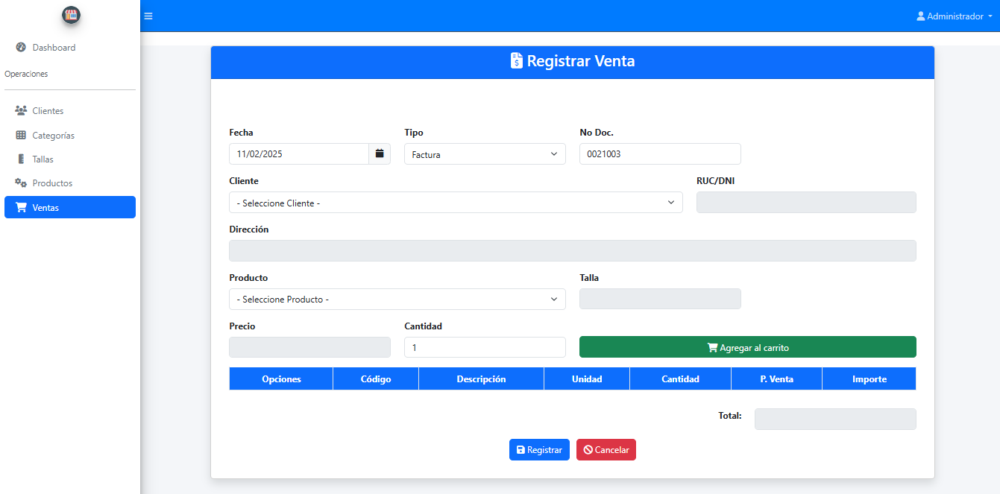
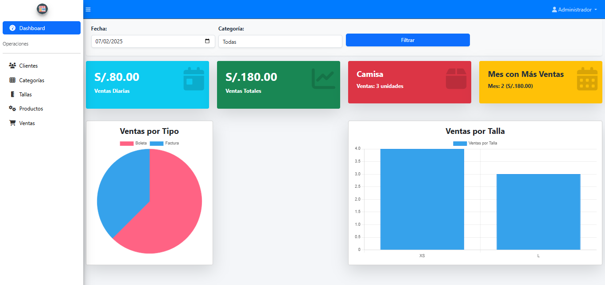

# Sistema Punto de Venta

Este es un sistema web de punto de venta desarrollado con Laravel, diseñado para facilitar el control de las ventas y automatizar la gestión del inventario. Con este sistema, se puede llevar un registro eficiente de las transacciones comerciales y controlar el stock de productos en tiempo real.

## Tecnologías Utilizadas
- **Lenguaje de Programación**: PHP
- **Framework**: Laravel
- **Base de Datos**: MySQL
- **Entorno de Desarrollo**: Visual Studio Code y XAMPP
- **Otros**: Composer para la gestión de dependencias

## Requisitos
- PHP 7.4 o superior
- Composer (para la instalación de dependencias)
- MySQL o MariaDB como gestor de base de datos
- XAMPP
